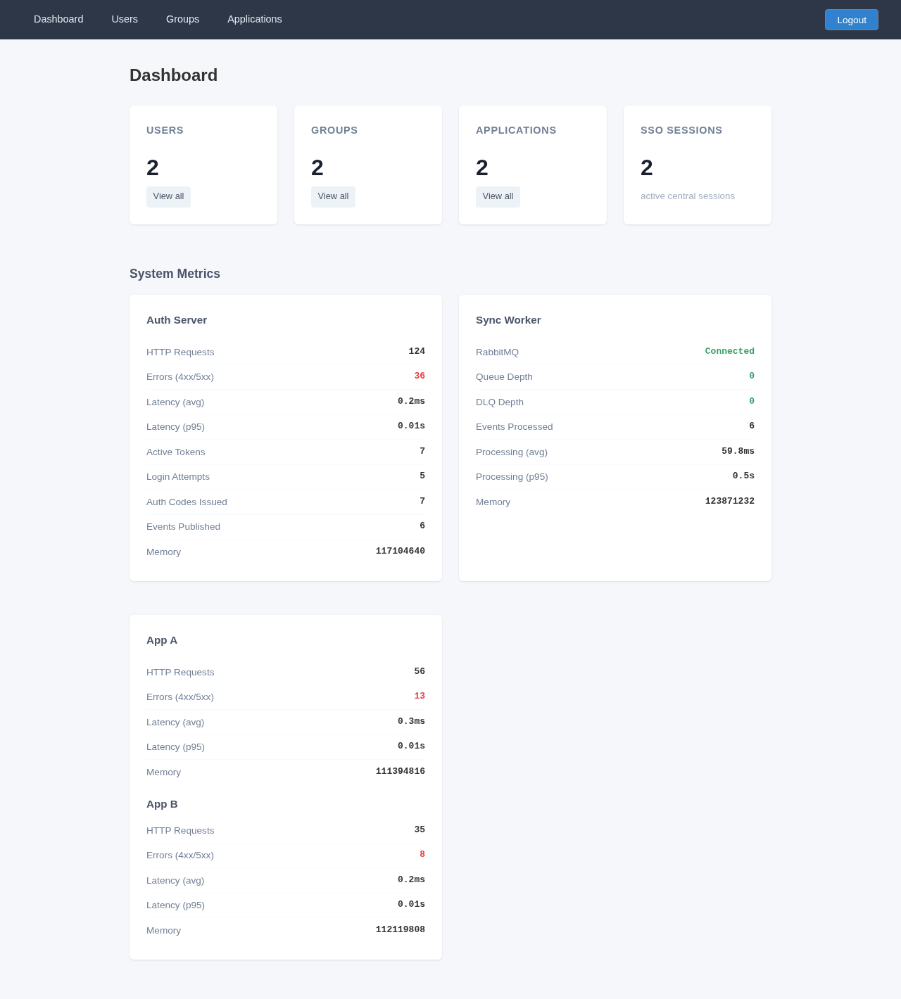
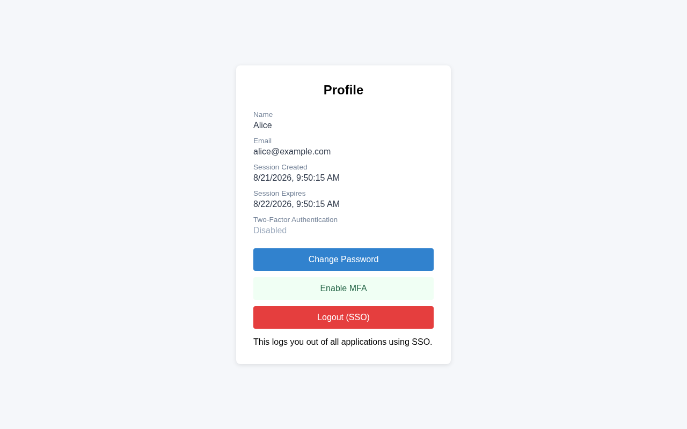
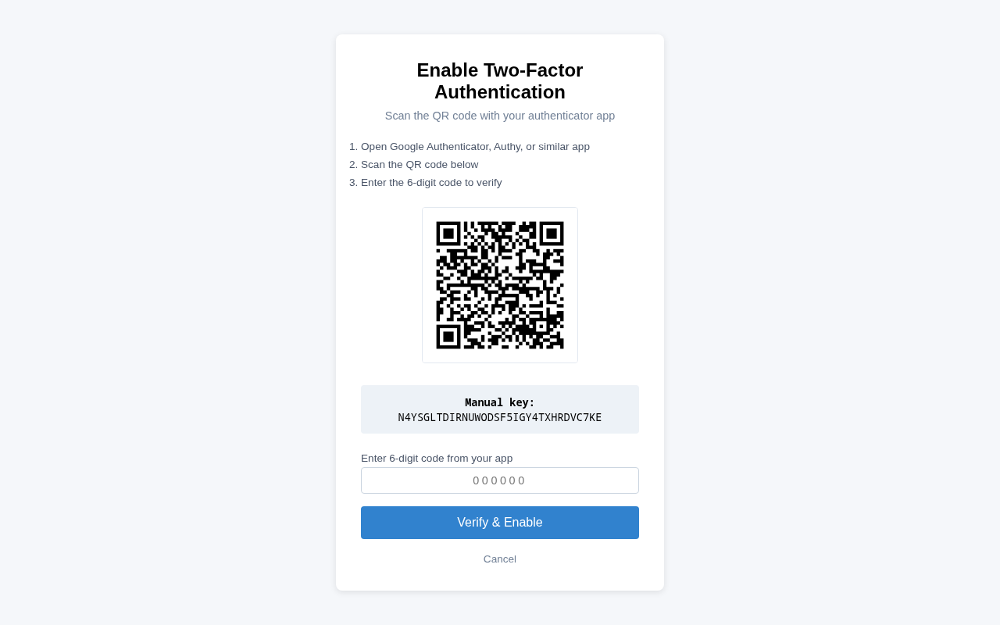
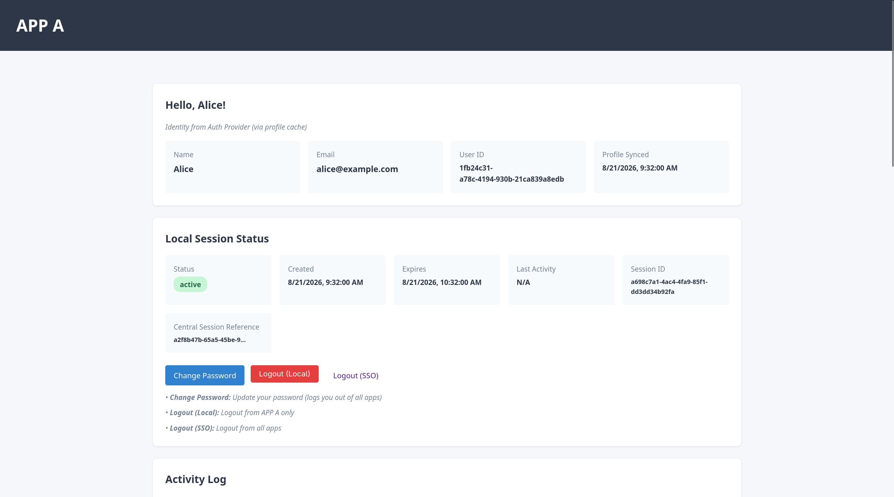

# AUTHored

Sistem autentikasi terpusat (SSO) dengan alur OAuth2, pemrosesan event async, dan 2 relying applications.

## Identitas

- **Nama**: Philipp Hamara
- **NIM**: 13524101

## Cara Menjalankan

### 1. Clone & Install

```bash
git clone https://github.com/philipphqiwu/AUTHored
cd AUTHored
npm install
```

### 2. Jalankan dengan Docker

```bash
docker compose up --build
```

Docker Compose akan otomatis:
- Menjalankan PostgreSQL dan RabbitMQ
- Menjalankan `prisma generate` dan `prisma db push` untuk setiap service
- Menjalankan seed data (users, groups, applications, policies)
- Menjalankan semua Node.js services

### 3. Akses Setiap Komponen

| Komponen | URL | Kredensial |
|----------|-----|------------|
| Auth Server | http://localhost:3000 | — |
| Control Panel | http://localhost:3001 | admin@authored.local / admin123 |
| App A | http://localhost:3002 | — |
| App B | http://localhost:3003 | — |
| Sync Worker Metrics | http://localhost:3004/metrics | — |
| RabbitMQ Management | http://localhost:15672 | guest / guest |

### 4. Test Users

| User | Email | Password | Access |
|------|-------|----------|--------|
| Alice | alice@example.com | password123 | App A + App B |
| Bob | bob@example.com | password123 | App A only |

### 5. Stop & Cleanup

```bash
docker compose down
docker compose down -v  # clean slate (hapus volumes)
```

## Arsitektur & Alur

### Arsitektur

```
┌─────────────────────────────────────────────────────────┐
│                    AUTH PROVIDER                        │
│  ┌──────────────┐  ┌──────────────┐  ┌──────────────┐   │
│  │ Control Panel│  │ Auth Server  │  │ Sync Worker  │   │
│  │ (Admin UI)   │  │ (OAuth2/SSO) │  │ (Async)      │   │
│  └──────────────┘  └──────────────┘  └──────────────┘   │
└─────────────────────────────────────────────────────────┘
           │                                    │
           ▼                                    ▼
    ┌─────────────┐                      ┌─────────────┐
    │   App A     │                      │   App B     │
    │ (Relying)   │                      │ (Relying)   │
    └─────────────┘                      └─────────────┘
           │                                    │
           └────────────┬───────────────────────┘
                        ▼
              ┌─────────────────┐
              │   PostgreSQL    │
              │  (3 databases)  │
              └─────────────────┘
                        │
              ┌─────────────────┐
              │   RabbitMQ      │
              │  (event queue)  │
              └─────────────────┘
```

### Alur Login Pertama (User → App A)

```
1. User klik "Login with SSO" di App A
2. App A redirect ke Auth Server /authorize
   (client_id, redirect_uri, state, code_challenge, code_challenge_method)
3. Auth Server tidak ada central session → redirect ke /login
4. User masukkan email + password
5. Auth Server validasi → create central session → set cookie
6. Auth Server evaluasi policy → issue authorization code
7. Auth Server redirect ke App A /callback?code=ABC&state=Y
8. App A validasi state → POST /token (back-channel, verify PKCE)
9. Auth Server verifikasi code + PKCE → issue access token
10. App A GET /userinfo → create local session
11. User melihat "Hello, <name>"
```

### Alur SSO (User → App B, sudah login)

```
1. User klik "Login with SSO" di App B
2. App B redirect ke Auth Server /authorize
3. Auth Server ada central session → skip login
4. Auth Server evaluasi policy → issue auth code
5. Auth Server redirect ke App B /callback
6. App B exchange code → get userinfo → create local session
7. User langsung masuk tanpa login ulang
```

### Alur SSO Logout

```
1. User klik "Logout (SSO)" di Auth Server
2. Auth Server revoke central session (sync)
3. Auth Server INSERT event ke outbox (transactional)
4. Event Publisher poll → publish ke RabbitMQ
5. Sync Worker consume → POST /internal/logout ke App A & App B
6. App A & App B revoke local sessions
7. Semua session di semua aplikasi ter-revoke
```

## Keputusan Teknis

### Token Strategy: Opaque Token

**Pilihan**: Opaque token (random string + DB lookup)

**Konsekuensi**:
- **Instant revocation**: Hapus row dari database, token langsung invalid
- **Simpler implementation**: Tidak perlu validasi signature/jwt.verify
- **No token bloat**: Token tidak membawa payload, ukuran kecil
- **DB lookup setiap request**: Setiap `/userinfo` harus query database
- **Scalability**: Database menjadi bottleneck di high traffic

Mengapa tidak JWT: Untuk sistem ini, instant revocation lebih penting dari performance. SSO logout harus langsung menyebar ke semua apps. Dengan JWT, token yang sudah logout masih valid sampai expiry.

### Message Broker: RabbitMQ

**Pilihan**: RabbitMQ dengan topic exchange

**Alasan**:
- Mature DLQ (Dead-Letter Queue) support bawaan
- Built-in retry mechanism dengan prefetch
- Management UI di port 15672 untuk monitoring
- AMQP protocol yang reliable (persistent messages)

**Konfigurasi**:
- Exchange: `auth_events` (topic, durable)
- Queue: `sync_worker_queue` (durable)
- DLQ: `sync_worker_dlq` (durable)
- Binding: `sessionrevoked`, `passwordchanged`, `accesspolicychanged`

### Service-to-Service Authentication: HMAC Signature

**Pilihan**: Shared secret + HMAC-SHA256 signature

**Mekanisme**:
1. Sync Worker dan Apps share secret yang sama (`shared-secret-change-in-production`)
2. Setiap request ke `/internal/logout` menyertakan header `X-Signature`
3. Signature dihitung: `HMAC-SHA256(secret, JSON.stringify(body))`
4. Apps verifikasi signature sebelum memproses request
5. Apps juga memverifikasi timestamp freshness (5 menit window)
6. Apps melakukan idempotent checking via `processed_events` table

**Mengapa HMAC**: Lebih sederhana dari mTLS, cukup untuk internal communication.

### Delete Strategy: Soft Delete

**Implementasi**:
- Users: field `status` ('active' / 'inactive'), tidak pernah dihapus
- SSO Sessions: field `status` ('active' / 'revoked'), tetap ada di DB untuk audit
- Access Tokens: field `status` ('active' / 'revoked'), bisa di-revoke
- Authorization Codes: field `usedAt` (null atau timestamp)

**Alasan**:
- Audit trail tetap terjaga
- Data recovery bisa dilakukan
- History login/logout tetap tersimpan

## Technology Stack

| Komponen | Teknologi | Versi |
|----------|-----------|-------|
| Runtime | Node.js | 20+ (Docker: node:20-bookworm-slim) |
| Language | TypeScript | ^5.x |
| Web Framework | Express | ^4.19.2 |
| ORM | Prisma | ^5.22.0 |
| Database | PostgreSQL | 16-alpine |
| Message Broker | RabbitMQ | 3-management-alpine |
| Password Hash | bcrypt | ^5.1.1 |
| Templating | EJS | ^3.1.10 |
| MFA | speakeasy | ^2.0.0 |
| QR Code | qrcode | ^1.5.4 |
| Metrics | prom-client | ^15.1.3 |
| AMQP Client | amqplib | ^0.10.9 |
| Container | Docker + docker-compose | — |

## Daftar Endpoint

### Auth Server (Port 3000)

#### Public Endpoints

| Method | Endpoint | Deskripsi |
|--------|----------|-----------|
| GET | `/login` | Halaman login |
| POST | `/login` | Proses login (validasi credentials) |
| GET | `/logout` | Halaman konfirmasi logout |
| POST | `/logout` | Proses SSO logout (revoke session + emit event) |
| GET | `/health/live` | Liveness probe |
| GET | `/health/ready` | Readiness probe (check DB + RabbitMQ) |
| GET | `/metrics` | Prometheus metrics |

#### OAuth2 Endpoints

| Method | Endpoint | Deskripsi |
|--------|----------|-----------|
| GET | `/authorize` | OAuth2 authorization endpoint |
| POST | `/token` | Token exchange (authorization_code grant) |
| GET | `/userinfo` | User profile (Bearer token required) |

#### Profile & Password

| Method | Endpoint | Deskripsi |
|--------|----------|-----------|
| GET | `/profile` | Halaman profil user (session required) |
| GET | `/password/change` | Halaman ubah password |
| POST | `/password/change` | Proses ubah password |

#### MFA Endpoints

| Method | Endpoint | Deskripsi |
|--------|----------|-----------|
| GET | `/mfa/setup` | Halaman setup TOTP MFA |
| POST | `/mfa/setup` | Verifikasi kode awal + enable MFA |
| GET | `/mfa/verify` | Halaman verifikasi MFA (login flow) |
| POST | `/mfa/verify` | Verifikasi TOTP/recovery code |
| GET | `/mfa/disable` | Halaman disable MFA |
| POST | `/mfa/disable` | Proses disable MFA |

### Control Panel (Port 3001)

| Method | Endpoint | Deskripsi |
|--------|----------|-----------|
| GET | `/` | Dashboard admin (dengan metrics) |
| GET | `/login` | Login admin |
| POST | `/login` | Proses login admin |
| GET | `/logout` | Logout admin |
| GET/POST | `/users` | CRUD users |
| GET/POST | `/groups` | CRUD groups |
| GET/POST | `/applications` | CRUD applications + policies |

### App A (Port 3002) & App B (Port 3003)

| Method | Endpoint | Deskripsi |
|--------|----------|-----------|
| GET | `/` | Home page (login button / profile) |
| GET | `/login` | Redirect ke Auth Server (OAuth2 flow) |
| GET | `/callback` | OAuth2 callback (exchange code → token → userinfo) |
| POST | `/logout` | Local logout (hanya revoke local session) |
| POST | `/internal/logout` | Back-channel logout (dari Sync Worker) |
| GET | `/health/live` | Liveness probe |
| GET | `/health/ready` | Readiness probe |
| GET | `/metrics` | Prometheus metrics |

### Sync Worker (Port 3004)

| Method | Endpoint | Deskripsi |
|--------|----------|-----------|
| GET | `/metrics` | Prometheus metrics (queue depth, events processed, etc) |
| GET | `/health/live` | Liveness probe |
| GET | `/health/ready` | Readiness probe (check RabbitMQ connection) |

## Bonus yang Dikerjakan

### B01: TOTP MFA

- **Setup**: User bisa mengaktifkan MFA dari halaman profile
- **QR Code**: Generate QR code untuk authenticator app (Google Authenticator, Authy, dll)
- **Verification**: Setiap login dengan MFA aktif harus memasukkan kode TOTP
- **Recovery Codes**: 8 recovery codes di-generate saat setup, bcrypt hashed, satu kali pakai
- **Disable**: User bisa menonaktifkan MFA dengan verifikasi kode TOTP
- **Audit Log**: Semua aktivitas MFA (enable, disable, verify success/fail, recovery) dicatat

### B02: Metrics Dashboard

- **Prometheus Endpoint**: `/metrics` di semua service (auth-server, app-a, app-b, sync-worker)
- **Custom Metrics**: HTTP requests, login attempts, MFA verifications, active sessions, tokens, auth codes, events published, queue depth, DLQ depth
- **Default Metrics**: CPU, memory, event loop, garbage collection (Node.js)
- **Dashboard**: Halaman metrics di control panel yang fetch data dari semua service
- **RED Method**: Rate (request count), Errors (4xx/5xx), Duration (avg/p95 latency)

### B03: Health Probes

- **Liveness** (`/health/live`): 200 selama proses masih merespons, tidak mengecek dependency
- **Readiness** (`/health/ready`): Memeriksa koneksi database dan RabbitMQ. 503 + detail komponen jika ada yang down
- **Implementasi**: Di semua service (auth-server, control-panel, app-a, app-b, sync-worker)
- **Auto-recovery**: Readiness kembali 200 setelah dependency pulih tanpa perlu restart

### B04: Graceful Shutdown

- **Signal Handling**: SIGTERM dan SIGINT di semua service
- **Shutdown Timeout**: 10 detik, lalu `process.exit(1)`
- **Auth Server**: Clear metrics interval, disconnect event publisher, disconnect prisma
- **Sync Worker**: Cancel consumer, drain in-flight events (poll `inflightCount`), close channel/connection/prisma/metrics server
- **Apps**: `server.close()` (tunggu request in-flight selesai), lalu `prisma.$disconnect()`
- **Docker**: Semua service menggunakan `exec` agar SIGTERM forward langsung ke proses

## Keamanan

- Password di-hash dengan bcrypt (tidak pernah plaintext)
- Client secret di-hash (tidak pernah di frontend)
- Authorization code: one-time use, TTL 5 menit, bound ke app + redirect_uri + PKCE
- redirect_uri: exact match (bukan prefix)
- State parameter: CSRF prevention
- PKCE: code_challenge pada /authorize, code_verifier pada /token (S256)
- Cookies: HttpOnly, Secure, SameSite=Lax
- Tidak ada sensitive data di error responses
- HMAC signature untuk service-to-service authentication (`/internal/logout`)
- Audit logs untuk semua operasi kritis

## Screenshot

### Control Panel - Dashboard



### Auth Server - Profile



### Auth Server - MFA Setup



### App A - Home


